Tutorial
========

In this tutorial, we'll configure Keycloak for running our [small example](../examples/Main.hs).
First you should install and run Keycloak: [follow this tutorial](https://www.keycloak.org/docs/latest/getting_started/index.html).

The example is compiled and run this way:
```
$ stack install
$ example
```

But before running it, we should create a Client in Keycloak and retrieve the adapter config file.
In Keycloak admin panel, a realm named "demo":

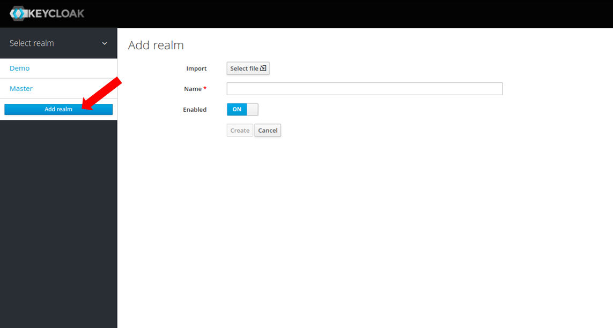

Add a client named "demo":


Then download the adapter config file in JSON format.

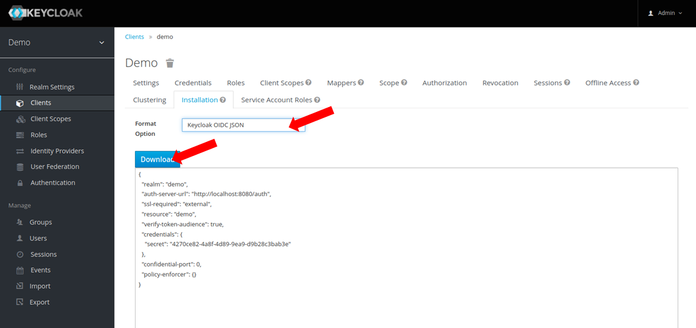

Place the file "keycloak.json" in this folder.

Authentication
--------------

The first function of Keycloak is to authenticate your users.
It can act as a login portal for your application: your users will be able to create an account autonomously, using e.g. Google or Facebook OpenID.
So you will not have to create a login page and users database! Everything can be managed from Keycloak.

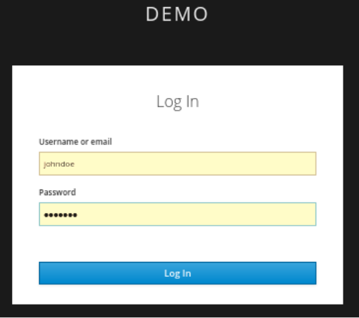

Authentication with Keycloak is based on [JWTs](https://jwt.io/).

In Keycloak, create a user named "demo" with password "demo".

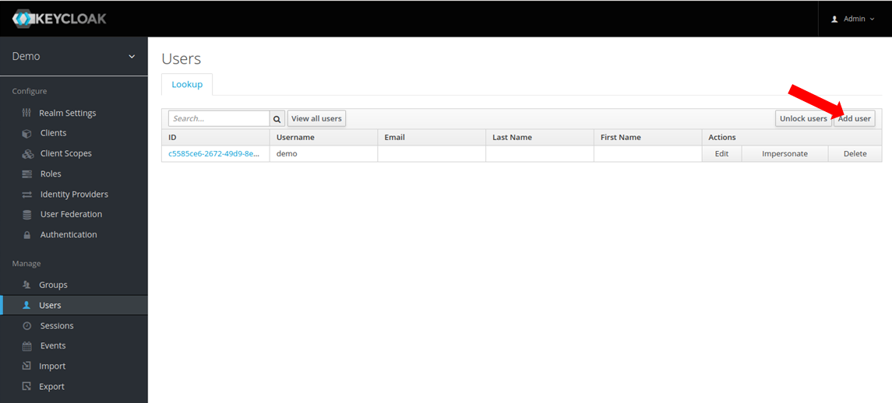

Make sure that your user is enable, email verified, and the password is not temporary.

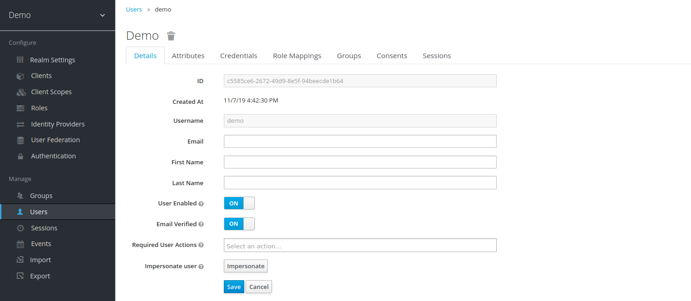

At this point, you should be able to retrieve tokens from Keycloak, verify them using this library, and extract a User from the tokens.

```
{-# LANGUAGE OverloadedStrings #-}

module Main where

import Keycloak
import Control.Monad
import Control.Monad.IO.Class

main :: IO ()
main = do

  -- Read the Keycloak config file. You can retrieve this file in your Client/Installation tab (JSON format).
  kcConfig <- configureKeycloak "keycloak.json"

  -- We run all the commands in the 'Keycloak' Monad.
  void $ flip runKeycloak kcConfig $ do
  
    -- Get a JWT from Keycloak. A JWT can then be used to authentify yourself with an application.
    jwt <- getJWT "demo" "demo"  --user/password is demo/demo 
```    

At this stage, we have a JWT! It contains a lot of informations about the user.
It can be sent to one of your applications. 
This application will be able to verify it autonomously, without any communication with Keycloak.

```
    -- Verify the token and retrieve the claims contained within.
    claims <- verifyJWT jwt
    liftIO $ putStrLn $ "Claims decoded from Token: \n" ++ (show claims) ++ "\n\n"
```

The token has be verified. This function would raise an error if the token is wrong/forged. 
You can also paste the token in an external tool to see its content, e.g. https://jwt.io/
Using the claims, we can extract all the users informations:

```
    -- get the user from the 
    let user = getClaimsUser claims
    liftIO $ putStrLn $ "User decoded from claims: \n" ++ (show user) ++ "\n\n"
```

In Keycloak, you can add attributes to your user. In Keycloak UI, go in the User Attributes tab and add an attribute, such as "phone".

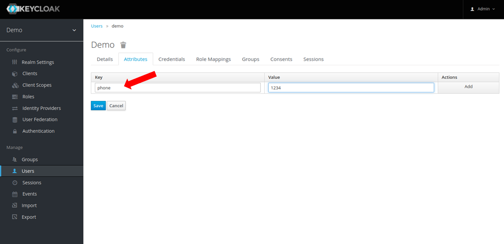

You can also add attributes than will be used by your application for access control.
For example, add an attribute "admin":


In order for this attribute to appear in the token claims, we should also add a client "mapper".
In the client "demo", click on "Mappers"/"add mappers".

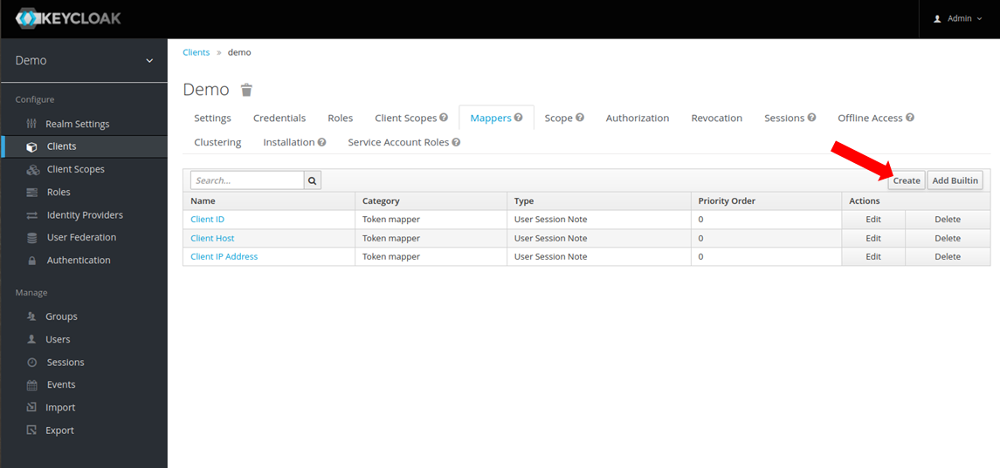

Fill the name="phone", Mapper Type=User attribute, Token Claim Name="phone", Claim JSON Type=String, and save.


Do the same for the "admin" attribute.
Your application is now able to read the phone number, and the admin status of the user, from the token itself.
This is a very efficient method, because once the token is acquired, no other communication with Keycloak is necessary.
The Token own embedded signature garantees that the information contained is legitimate.


Authorizations
--------------

Keycloak itself can also manage your resources and related access policies.
The idea is that, each time a user makes a request on your application, you will ask Keycloak "Can he really do that??".
This is a somewhat slower method that using the Token's claims to decide if a user has access to some resource in your application.
However, there is some merit in delegating all the authorization logic to Keycloak. 
The authorization logic will be centralized in Keycloak, instead of being disseminated in your applications.

In the client "demo":
- change "Access Type" to confidential
- turn "Authorization Enabled" ON.
- add "*" in Valid Redirect URIs.

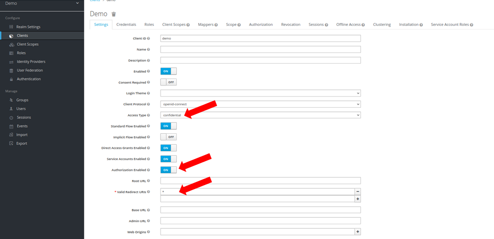

A new "Authorization" tab should appear.

Let's set up some authorization policies in order to demonstrate the capacity of Keycloak-hs.
We want to authorize our user "demo" to "view" some resource.
First go in the new "Authorization" tab that appeared.
Flip the "Remote Resource Management" on.


Create a new Scope in the "Authorization Scopes" tab. Name it "view".

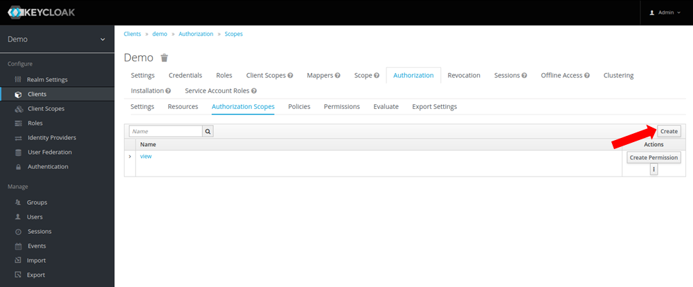

Now create a ressource that can be viewed:

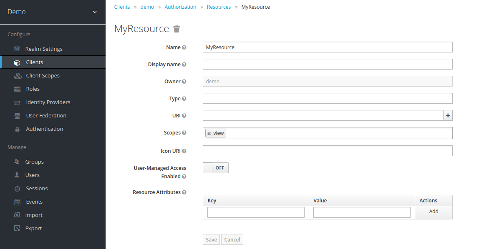

Create a new policy in the "Policies" tab with the following settings:
- Select "User" as policy type
- Name it "Demo user have access".
- Select user "demo" in the drop box.
- Logic should be positive.

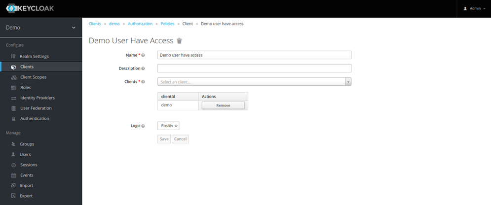

Create a new scope-based permission in the "Permissions" tab:
- Name it "View resources".
- Select "view" in Scopes.
- Select your previous policy "Demo user have access" in "Apply Policy".


We have now encoded that our user "demo" can view our resource "MyRessource".
That's it for the confguration of Keycloak.
We are now able to ask to Keycloak if a user has view access to our ressource:

```
    -- * Can our user view our resource?
    isAuth <- isAuthorized (ResourceId "MyResource") (ScopeName "view") jwt
```

If the answer if True, Bingo! The user has access.
Keycloak is very complex, so you'll have fun exploring all the possibilities ;)

Enjoy!
